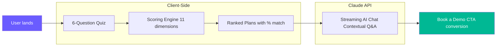
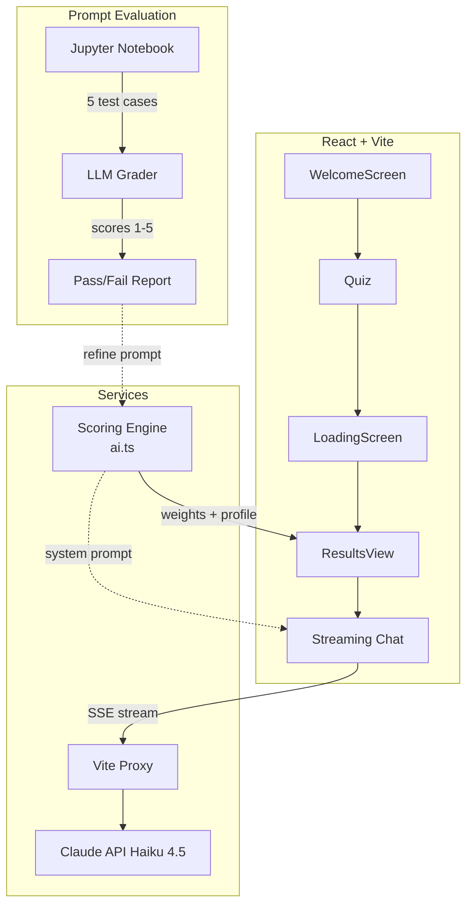

# Kota AI Agent

> An AI-powered benefits advisor that matches teams with the right Kota plan in under 60 seconds, then answers follow-up questions via streaming chat.

## Elevator Pitch (30s)

HR teams waste hours comparing benefits plans on spreadsheets. Kota AI Agent replaces that with a 6-question quiz scored across 11 dimensions, powered by a deterministic scoring engine. Once matched, users chat with a streaming AI advisor grounded in their plan data, so they never get hallucinated answers. We built a prompt evaluation grader to keep response quality high. The result: faster plan selection, higher confidence, more demo bookings.

## How It Works



## Architecture



## Key Features

- **Deterministic scoring** -- 11-dimension weighted engine runs client-side, no API needed for plan matching
- **Streaming AI chat** -- Claude Haiku 4.5 via SSE, tokens render in real-time
- **Prompt evaluation grader** -- 5 automated test cases score accuracy, guardrails, tone, and conciseness
- **Guardrailed responses** -- Geography, scope, and data boundaries enforced in the system prompt
- **Comparison view** -- Side-by-side feature matrix across all plans
- **Fallback resilience** -- Rule-based recommendations work without an API key

## Demo Script (3 min)

| Time | Section | What to show |
|------|---------|--------------|
| 0:00 | Problem | "HR teams spend hours comparing plans on spreadsheets" |
| 0:20 | Solution | Walk through the quiz (pick small team, moderate budget) |
| 0:50 | Scoring | Show results page with match percentages and insights |
| 1:10 | AI Chat | Click "How much will this cost my team?" -- show streaming |
| 1:30 | Guardrails | Ask "Can I get coverage for my dog?" -- show graceful decline |
| 1:50 | Eval | Switch to notebook, run `run_eval()`, show grader output |
| 2:20 | Compare | Show plan comparison table |
| 2:40 | Architecture | Show mermaid diagram, explain client-side scoring + API streaming |
| 2:50 | Wrap-up | "Faster decisions, grounded answers, quality you can measure" |

## Tech Stack

- **React 19** + **TypeScript** -- Component UI
- **Vite** -- Dev server with proxy for Claude API
- **Tailwind CSS v4** -- Styling
- **Framer Motion** -- Animations
- **Claude Haiku 4.5** -- Streaming AI chat via Anthropic API
- **Jupyter Notebook** -- Prompt evaluation grader

## Getting Started

```bash
git clone https://github.com/alanmaizon/kota-hackathon.git
cd kota-hackathon
npm install
cp .env.example .env
# Add your Anthropic API key to .env
npm run dev
```

Open [http://localhost:5173](http://localhost:5173)

## The Plans

| Plan | Price | Team Size | Best For |
|------|-------|-----------|----------|
| Startup | €/£9/employee/mo | 1-30 | Small teams starting with benefits |
| Scaleup | €/£6/employee/mo | 31-200 | Growing companies needing efficient processes |
| Growth | Talk to our team | 201+ | Competitive companies with full expert access |

## Project Structure

```
src/
├── data/plans.ts           # Plan data + weights
├── services/ai.ts          # Scoring engine + streaming chat
├── components/
│   ├── WelcomeScreen.tsx   # Landing page
│   ├── Quiz.tsx            # 6-question flow
│   ├── LoadingScreen.tsx   # Analysis animation
│   └── ResultsView.tsx     # Results + chat + comparison
├── App.tsx                 # Screen routing
└── types/index.ts          # TypeScript interfaces

notebooks/
└── kota_ai_chat.ipynb      # Prompt testing + evaluation grader
```

## Prompt Evaluation

The notebook at `notebooks/kota_ai_chat.ipynb` includes an automated grader that:

1. Runs 5 test cases (pricing, out-of-scope, comparisons, missing data, geography)
2. Generates a fresh AI response for each
3. Scores each response on accuracy, guardrails, tone, and conciseness (1-5)
4. Reports pass/fail with per-criterion reasoning

Run `run_eval()` to grade the current system prompt. Edit the prompt, re-run, compare scores.

---

Built for Kota Hackathon
